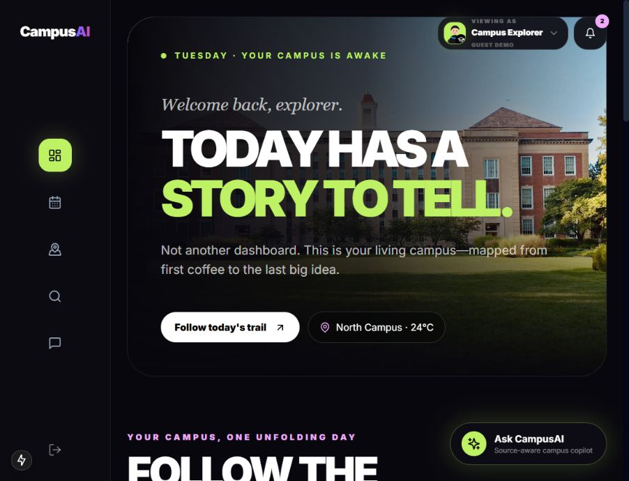
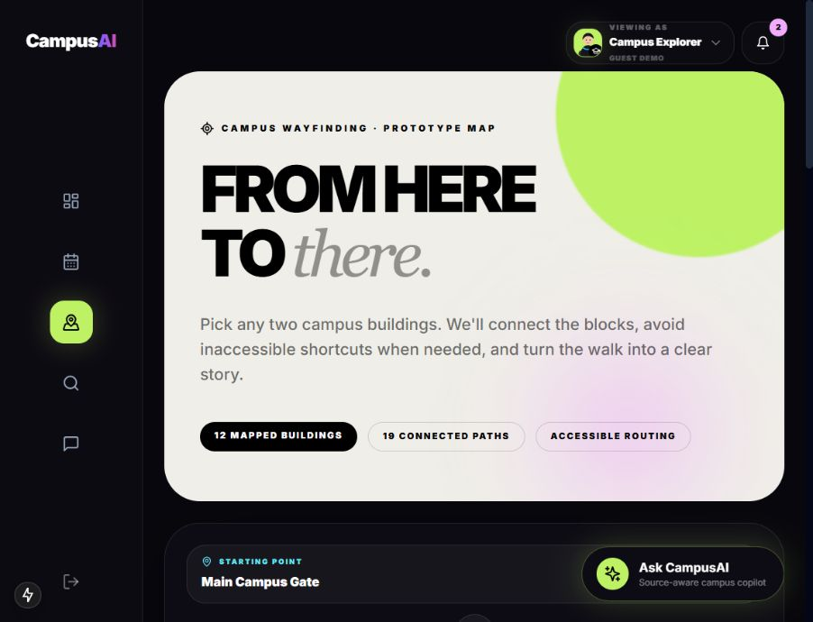
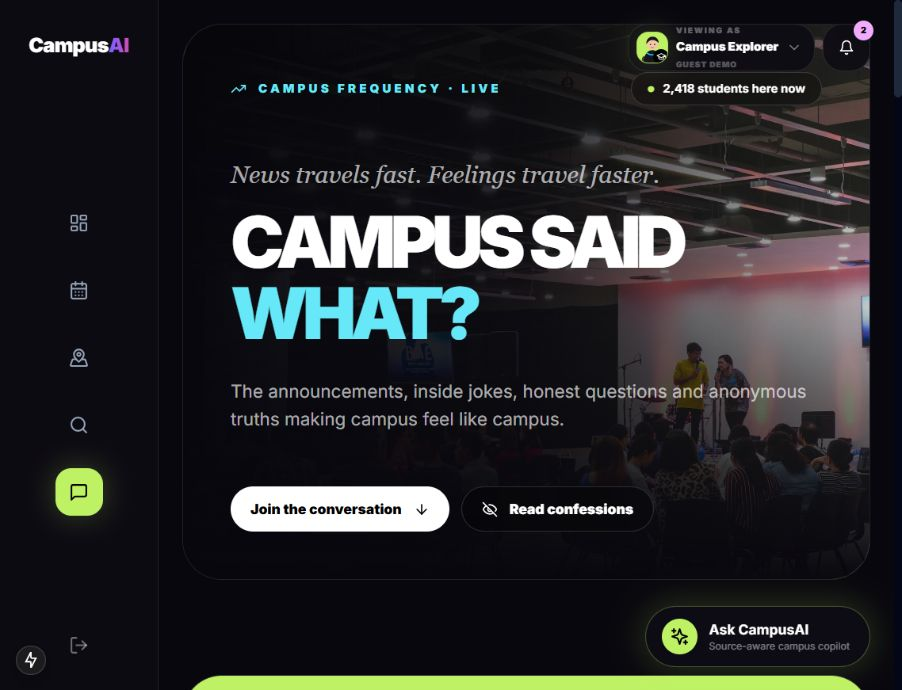
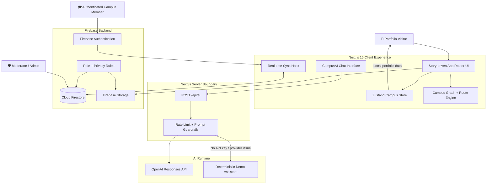

<div align="center">

# 🎓 Campus Connect AI

### One cinematic, intelligent operating system for modern campus life.

From the first coffee to the last big idea, Campus Connect AI turns university events, wayfinding, lost property, student conversations, safety workflows, and AI guidance into one connected story.

[](https://nextjs.org/)
[](https://www.typescriptlang.org/)
[](https://firebase.google.com/)
[](https://platform.openai.com/)
[](#license)

</div>

---

## ✨ Vision

Campus software is often a collection of disconnected portals. Campus Connect AI explores a different direction: a student-first experience where every part of the day feels discoverable, visual, and connected.

The platform combines an expressive Gen Z interface with practical university workflows:

- 🧭 Story-driven campus dashboard and daily activity trail
- 🎟️ Intelligent event discovery, RSVP, waitlist, and approval workflows
- 🗺️ Building-to-building route planning with accessible path support
- 🕵️ Privacy-first Lost & Found investigation and ownership verification
- 💬 Named campus posts and moderated anonymous student confessions
- ✨ Source-aware CampusAI copilot with live and deterministic demo modes
- 🛡️ Authenticated moderator and administrator command center
- ☁️ Firebase-backed real-time data, protected uploads, and role security

---

## 📸 Product Screenshots

### Living campus dashboard



<table>
  <tr>
    <td width="50%">
      <strong>🗺️ Campus wayfinding</strong><br/><br/>
      
    </td>
    <td width="50%">
      <strong>💬 Campus feed & confessions</strong><br/><br/>
      
    </td>
  </tr>
</table>

---

## 🚀 What Is Campus Connect AI?

Campus Connect AI is a full-stack smart-campus experience built for students, faculty, moderators, and university administrators. It preserves a polished guest demo for portfolio visitors while activating authenticated cloud workflows for real users.

The project is built around implemented functionality:

- **Campus Story Engine** — cinematic dashboard sections, motion-led storytelling, role personas, responsive navigation, and campus activity insights.
- **Event Operations** — event discovery, intelligent matching, RSVP and waitlist persistence, protected creation, and approval queues.
- **Campus Wayfinding** — a curated building graph, shortest-route calculation, accessible routing preferences, landmark guidance, and step-by-step directions.
- **Smart Lost & Found** — visual-evidence uploads, public clue cards, private ownership details, claim records, and moderator-supported verification.
- **Community Layer** — named posts, image uploads, AI summaries, anonymous confessions, safety review, and human moderation.
- **CampusAI Copilot** — ChatGPT-style conversation UI backed by a server-only OpenAI route with rate limiting and an honest offline fallback.
- **Operations Command Center** — authenticated moderation, event approvals, service metrics, audit records, and role-aware access.

---

## 🧩 Key Features

| Feature | What it delivers | Status |
|---|---|:---:|
| 🎬 Storytelling Dashboard | Cinematic campus hero, activity trail, insights, and persona-aware presentation | ✅ Implemented |
| 🎟️ Smart Events | Discovery, match scores, RSVP, capacity-aware waitlists, creation, and approval | ✅ Implemented |
| 🗺️ Campus Map | Twelve building nodes, connected paths, route calculation, and accessible routing | ✅ Implemented |
| 🕵️ Lost & Found | Case reporting, evidence images, signal confidence, private details, and claims | ✅ Implemented |
| 💬 Campus Feed | Named updates, media uploads, summaries, reactions, and conversation UI | ✅ Implemented |
| 🤫 Student Confessions | Anonymous submission with a safety-review lifecycle | ✅ Implemented |
| ✨ CampusAI Assistant | Conversational campus guidance, safe prompting, rate limits, and demo fallback | ✅ Implemented |
| 🔐 Authentication | Email/password and Google authentication through Firebase | ✅ Implemented |
| 🛡️ Role Security | Student, faculty, moderator, and admin authorization enforced by Firestore rules | ✅ Implemented |
| ⚡ Real-time Sync | Firestore listeners for events, cases, posts, confessions, RSVPs, and notifications | ✅ Implemented |
| 🖼️ Protected Uploads | Firebase Storage image validation with authenticated ownership and a 5 MB limit | ✅ Implemented |
| 🧑‍💼 Command Center | Moderation queue, approval actions, metrics, and immutable audit-log writes | ✅ Implemented |
| 🖱️ Motion System | Smooth cursor tracking, responsive transitions, and scroll-led storytelling | ✅ Implemented |

---

## 🏗️ System Architecture



### Request and data flow

1. **Visitor experience** — seed data and persisted local state render a complete demo without requiring authentication.
2. **Identity resolution** — Firebase Authentication establishes the current user and loads the trusted role from `users/{uid}`.
3. **Cloud activation** — authenticated sessions attach Firestore listeners and merge cloud records into the campus store.
4. **Protected mutations** — event creation, RSVPs, posts, cases, claims, and moderation actions are validated by Firebase Security Rules.
5. **Private evidence separation** — public Lost & Found clues live in `lostItems/{caseId}` while identifying evidence lives in a protected private subcollection.
6. **AI interaction** — chat messages reach a Next.js server route; API credentials never enter the browser.
7. **Graceful fallback** — without an OpenAI key, the assistant returns transparent deterministic campus-demo guidance.

---

## 🧠 CampusAI Assistant

CampusAI is designed as a source-aware campus copilot rather than a generic chatbot.

- ChatGPT-style message experience
- Server-only OpenAI API key
- Per-IP request rate limiting
- Campus-focused system instructions
- Prompt-length validation
- Friendly failure handling
- Deterministic fallback when no provider key is configured
- No private Lost & Found evidence is included in AI prompts

The assistant route is implemented at `src/app/api/ai/route.ts`.

---

## 🔐 Security & Privacy Model

The persona selector changes the visual storytelling perspective only. It never grants permissions.

| Role | Core capabilities |
|---|---|
| 🎓 Student | Discover events, RSVP, post updates, submit confessions, report items, request claims |
| 📚 Faculty | Campus-member capabilities plus broader event visibility |
| 🛡️ Moderator | Review community reports, confessions, claims, and event submissions |
| 👑 Admin | Trusted operational access and role-administration boundary |

Security controls include:

- New accounts always start as `student`
- Staff access comes from the authenticated Firestore user document
- Lost-item ownership evidence is separated from public case data
- Anonymous confessions do not store a public author identity
- Storage rules restrict uploads to authenticated owners, images, and 5 MB
- Moderator actions create audit records
- `.env.local`, provider secrets, generated builds, and local Firebase artifacts are excluded from Git

See [`SECURITY.md`](SECURITY.md) for deployment and vulnerability-reporting guidance.

---

## 🛠️ Technology Stack

### Frontend

- **Next.js 15** — App Router, server routes, optimized images, and production builds
- **React 18** — component architecture and interactive campus workflows
- **TypeScript** — strict typing across state, services, pages, and Firebase operations
- **Tailwind CSS** — responsive design system and expressive visual composition
- **Framer Motion** — page entrances, story transitions, role switcher, and scroll motion
- **Lucide React** — consistent icon language
- **Recharts** — activity and operational data visualization
- **Zustand** — versioned local state with guest-demo persistence

### Backend and data

- **Firebase Authentication** — email/password and Google identity
- **Cloud Firestore** — real-time campus data, moderation, claims, and notifications
- **Firebase Storage** — protected event, feed, and Lost & Found imagery
- **Firebase Security Rules** — authenticated, role-aware, field-aware access control
- **Next.js Route Handlers** — server-side CampusAI gateway
- **OpenAI Responses API** — optional live conversational intelligence

### Developer experience

- **pnpm 11** — deterministic dependency management
- **ESLint + TypeScript** — build-time correctness checks
- **Firebase CLI configuration** — deployable Firestore indexes and Storage rules

---

## 📁 Project Structure

```text
campus-connect-ai/
├── docs/
│   └── screenshots/              # Product images used by this README
├── src/
│   ├── app/
│   │   ├── api/ai/               # Server-only CampusAI route
│   │   ├── admin/                # Moderator command center
│   │   ├── campus-map/           # Building graph and directions UI
│   │   ├── dashboard/            # Campus storytelling home
│   │   ├── events/               # Event discovery and creation
│   │   ├── feed/                 # Community posts and confessions
│   │   ├── lost-found/           # Smart case investigation
│   │   ├── login/                # Authentication
│   │   └── register/             # Account creation
│   ├── components/
│   │   ├── ai/                   # CampusAI interface and recommendations
│   │   └── ui/                   # Shared visual primitives
│   ├── firebase/                 # Firebase initialization and auth helpers
│   ├── hooks/                    # Auth and Firestore synchronization
│   ├── services/                 # Campus backend operations
│   ├── store/                    # Zustand user and campus state
│   └── utils/                    # AI and shared utility logic
├── firebase.json                 # Firebase deployment definition
├── firestore.rules              # Database authorization policy
├── firestore.indexes.json       # Firestore indexes
├── storage.rules                # Protected upload policy
└── .env.example                 # Safe environment-variable template
```

---

## ⚙️ Installation

### Prerequisites

- Node.js 20+
- pnpm 11+
- A Firebase project for live multi-user features
- An OpenAI API key only if live CampusAI responses are required

### 1. Clone the repository

```bash
git clone https://github.com/varanasisatya/campus-connet.git
cd campus-connet
```

### 2. Install dependencies

```bash
pnpm install
```

### 3. Configure the environment

Copy `.env.example` to `.env.local` and add your Firebase web-app values:

```env
NEXT_PUBLIC_FIREBASE_API_KEY=
NEXT_PUBLIC_FIREBASE_AUTH_DOMAIN=
NEXT_PUBLIC_FIREBASE_PROJECT_ID=
NEXT_PUBLIC_FIREBASE_STORAGE_BUCKET=
NEXT_PUBLIC_FIREBASE_MESSAGING_SENDER_ID=
NEXT_PUBLIC_FIREBASE_APP_ID=

# Server-only. Never use a NEXT_PUBLIC_ prefix.
OPENAI_API_KEY=
OPENAI_MODEL=gpt-5.4-mini
```

### 4. Start the development server

```bash
pnpm dev
```

Open `http://localhost:3000`. The root route forwards to the dashboard.

### 5. Verify the production build

```bash
pnpm build
pnpm start
```

---

## 🔥 Firebase Setup

1. Create a Firebase web application.
2. Enable **Email/Password** and **Google** authentication.
3. Create a Cloud Firestore database.
4. Enable Firebase Storage.
5. Add the Firebase web configuration to `.env.local`.
6. Deploy the checked-in rules and indexes:

```bash
npx firebase-tools login
npx firebase-tools use YOUR_FIREBASE_PROJECT_ID
npx firebase-tools deploy --only firestore,storage
```

To grant a trusted staff account access, update `users/{uid}.role` in the Firebase console to `faculty`, `moderator`, or `admin`. Do not build role elevation into a client control.

---

## 🗃️ Core Firestore Collections

| Collection | Purpose |
|---|---|
| `users` | Profile and trusted campus role |
| `events` | Approved and pending university events |
| `eventRsvps` | Per-user RSVP or waitlist state |
| `posts` | Named campus community updates |
| `confessions` | Anonymous safety-reviewed submissions |
| `lostItems` | Public Lost & Found clues |
| `lostItems/{id}/private` | Reporter-only identifying evidence |
| `claims` | Protected ownership-verification requests |
| `moderation` | Staff review queue |
| `auditLogs` | Append-only moderation actions |
| `users/{uid}/notifications` | Private user notifications |

---

## ♿ Accessibility & Experience

- Skip-to-content navigation
- Semantic buttons, headings, labels, and dialogs
- Keyboard dismissal for overlays
- High-contrast interaction states
- Responsive desktop and mobile navigation
- Accessible route preference in campus wayfinding
- Text alternatives for important product imagery
- Smooth motion designed around transform and opacity

---

## 🧪 Verification

The project has been verified with:

- ✅ Strict TypeScript production compilation
- ✅ Next.js static and dynamic route generation
- ✅ Dashboard, events, map, feed, Lost & Found, admin, login, and register route checks
- ✅ Browser rendering and navigation checks
- ✅ Browser console and framework-overlay checks
- ✅ Git secret-pattern scan before publication

---

## 🛣️ Roadmap

- 📍 Integrate institution-approved GPS and indoor positioning data
- 🧠 Add embeddings for semantic event and Lost & Found matching
- 📲 Introduce push notifications and calendar synchronization
- 🧪 Add Firebase Emulator Suite integration tests for security rules
- 📊 Build staff analytics from privacy-preserving aggregates
- 🆘 Connect safety workflows to institution-approved escalation systems
- 🗺️ Import verified building geometry and accessibility metadata
- 📱 Package the experience as an installable PWA

---

## ⚠️ Production Boundary

This repository contains a deployable application backend, but a real university rollout still requires institution-owned data, privacy-impact review, verified map and accessibility data, monitoring, backups, penetration testing, incident-response procedures, and staff onboarding.

The campus map currently demonstrates routing with curated nodes. It does not claim live GPS or indoor positioning.

---

## 👨‍💻 Author

Built by **[varanasisatya](https://github.com/varanasisatya)** as a portfolio-grade exploration of AI-assisted campus operations, privacy-aware community software, and cinematic product design.

If this project inspires you, consider giving the repository a ⭐.

---

## 📄 License

No open-source license has been selected yet. All rights are reserved unless a license is added to the repository.
